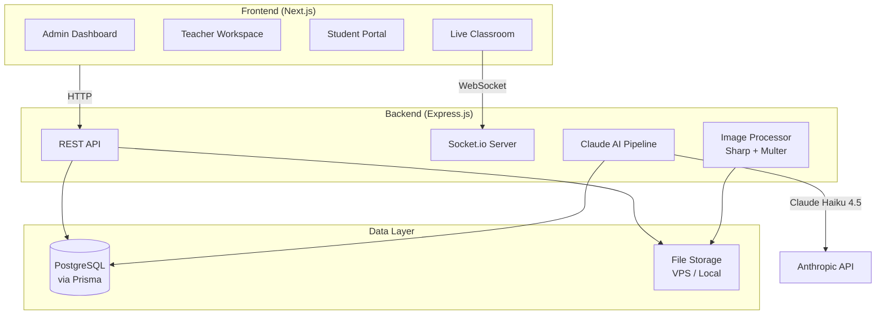

# rv2class — Russian Off2Class Alternative

A full-featured online teaching platform with live synchronized classrooms, AI-powered content generation, and automated homework grading. Built for Russian-speaking English teachers and their students.

## Architecture Overview



## Tech Stack

| Layer | Technology | Purpose |
|-------|-----------|---------|
| Frontend | Next.js 15 (React 19) | SPA with SSR capabilities |
| UI Components | Tailwind CSS 4 + Shadcn UI | Premium "Slate & Blue" educational theme |
| Backend | Node.js + Express | REST API + WebSocket server |
| Database | PostgreSQL + Prisma ORM | Relational data (users, courses, lessons, grades) |
| Real-time | Socket.io | Slide sync + whiteboard annotations |
| Whiteboard | Fabric.js | Drawing, typing, erasing over slides |
| AI Pipeline | Claude Haiku 4.5 (Anthropic API) | Auto-generate teacher notes + homework from slide images |
| Image Processing | Sharp + Multer | Resize/compress uploaded PNGs → JPEGs |
| Localization | i18next + react-i18next | Russian-first UI |
| Auth | JWT (jsonwebtoken + bcrypt) | Role-based access (Admin/Teacher/Student) |
| Payments | Prodamus / Robokassa | Russian payment processing for teacher subscriptions |
| Deployment | Docker + docker-compose | PostgreSQL + Express + Next.js on VPS |

## Project Structure

```
rv2class/
├── client/                    # Next.js frontend
│   ├── public/
│   │   └── locales/
│   │       └── ru/
│   │           └── common.json    # Russian translations
│   ├── src/
│   │   ├── app/                   # Next.js App Router
│   │   │   ├── layout.tsx
│   │   │   ├── page.tsx           # Landing / Login
│   │   │   ├── admin/             # Admin routes
│   │   │   ├── teacher/           # Teacher routes
│   │   │   ├── student/           # Student routes
│   │   │   └── classroom/         # Live classroom
│   │   ├── components/
│   │   │   ├── ui/                # Shadcn components
│   │   │   ├── admin/             # Admin-specific components
│   │   │   ├── teacher/           # Teacher-specific components
│   │   │   ├── student/           # Student-specific components
│   │   │   └── classroom/         # Whiteboard, SlideViewer, etc.
│   │   ├── lib/
│   │   │   ├── api.ts             # HTTP client
│   │   │   ├── socket.ts          # Socket.io client
│   │   │   └── i18n.ts            # i18next config
│   │   ├── hooks/
│   │   └── contexts/
│   ├── tailwind.config.ts
│   ├── next.config.ts
│   └── package.json
│
├── server/                    # Express backend
│   ├── src/
│   │   ├── index.ts               # Entry point
│   │   ├── routes/
│   │   │   ├── auth.ts
│   │   │   ├── admin.ts
│   │   │   ├── teacher.ts
│   │   │   ├── student.ts
│   │   │   ├── lessons.ts
│   │   │   └── homework.ts
│   │   ├── middleware/
│   │   │   ├── auth.ts            # JWT verification
│   │   │   └── roles.ts           # RBAC middleware
│   │   ├── services/
│   │   │   ├── ai.ts              # Claude API integration
│   │   │   ├── imageProcessor.ts  # Sharp resize/compress
│   │   │   └── autoGrader.ts      # Homework grading logic
│   │   ├── socket/
│   │   │   ├── index.ts           # Socket.io setup
│   │   │   ├── classroom.ts       # Slide sync + whiteboard events
│   │   │   └── types.ts
│   │   └── utils/
│   ├── prisma/
│   │   ├── schema.prisma          # Database schema
│   │   └── seed.ts                # Initial data
│   ├── uploads/                   # Slide images storage
│   ├── tsconfig.json
│   └── package.json
│
├── docker-compose.yml
├── Dockerfile.client
├── Dockerfile.server
└── instructions.md
```

---

## Phase 1: Core Foundation & UI System (Tasks 1–3)

### Task 1: Project Initialization

#### [NEW] `client/` — Next.js app
- Initialize with `npx -y create-next-app@latest ./client` (TypeScript, App Router, Tailwind)
- Configure for client-side rendering where needed (classroom is fully client-side)

#### [NEW] `server/` — Express backend
- Initialize Node.js project with TypeScript
- Install: `express`, `cors`, `dotenv`, `socket.io`, `jsonwebtoken`, `bcryptjs`
- Configure TypeScript compilation with `tsx` for dev

### Task 2: UI Styling — "Slate & Blue" Educational Theme
- Install Shadcn UI components (`npx shadcn@latest init`)
- Custom color palette:
  - Primary: Deep blue (`hsl(220, 70%, 50%)`) — trust, education
  - Secondary: Slate (`hsl(215, 20%, 65%)`) — clean, professional
  - Accent: Warm amber (`hsl(45, 90%, 55%)`) — CTAs, highlights
  - Background: Cool gray (`hsl(220, 15%, 97%)`) light / `hsl(220, 20%, 10%)` dark
- Dark mode support from day one

### Task 3: Russian Localization
- Install `i18next`, `react-i18next`, `i18next-http-backend`
- Create `public/locales/ru/common.json` with all UI strings in Russian
- Every component uses `useTranslation()` — zero hardcoded strings

---

## Phase 2: Database Schema & Authentication (Tasks 4–7)

### Task 4: Prisma ORM Setup
- Install `prisma` and `@prisma/client`
- Configure for PostgreSQL connection via `DATABASE_URL`

### Task 5–7: Full Database Schema

```prisma
// Core models (simplified view)

model User {
  id        String   @id @default(uuid())
  email     String   @unique
  password  String   // bcrypt hashed
  name      String
  role      Role     @default(STUDENT)
  // Teacher-specific
  students     User[]   @relation("TeacherStudents")
  teacher      User?    @relation("TeacherStudents")
  teacherId    String?
  // Subscriptions
  subscription Subscription?
}

enum Role {
  ADMIN
  TEACHER
  STUDENT
}

model Course {
  id      String   @id @default(uuid())
  title   String
  lessons Lesson[]
}

model Lesson {
  id          String        @id @default(uuid())
  title       String
  courseId     String
  course      Course        @relation(fields: [courseId], references: [id])
  slides      Slide[]
  homework    Homework[]
  published   Boolean       @default(false)
}

model Slide {
  id           String        @id @default(uuid())
  lessonId     String
  lesson       Lesson        @relation(fields: [lessonId], references: [id])
  orderIndex   Int
  imageUrl     String        // path to compressed JPEG
  originalUrl  String        // path to original PNG
  teacherNote  TeacherNote?
}

model TeacherNote {
  id              String  @id @default(uuid())
  slideId         String  @unique
  slide           Slide   @relation(fields: [slideId], references: [id])
  suggestedQuestions String  // JSON array of questions
  correctAnswers    String  // JSON array of answers
  tips              String? // Additional teaching tips
}

model Homework {
  id             String  @id @default(uuid())
  lessonId       String
  lesson         Lesson   @relation(fields: [lessonId], references: [id])
  questionText   String
  exerciseType   ExerciseType
  options        String?  // JSON array for multiple choice
  correctAnswer  String
  orderIndex     Int
}

enum ExerciseType {
  FILL_IN_BLANK
  MULTIPLE_CHOICE
  TRUE_FALSE
  SHORT_ANSWER
}

model HomeworkAssignment {
  id          String   @id @default(uuid())
  lessonId    String
  studentId   String
  teacherId   String
  assignedAt  DateTime @default(now())
  submittedAt DateTime?
  score       Float?
  teacherComment String?
  gradeOverride  Float?
  responses   HomeworkResponse[]
}

model HomeworkResponse {
  id            String   @id @default(uuid())
  assignmentId  String
  homeworkId    String   // links to specific Homework question
  studentAnswer String
  isCorrect     Boolean
  assignment    HomeworkAssignment @relation(fields: [assignmentId], references: [id])
}

model ClassSession {
  id          String   @id @default(uuid())
  lessonId    String
  teacherId   String
  currentSlide Int     @default(0)
  isActive    Boolean  @default(true)
  startedAt   DateTime @default(now())
  canvasStates String? // JSON map of slide index → Fabric.js canvas JSON
}

model Subscription {
  id        String   @id @default(uuid())
  userId    String   @unique
  user      User     @relation(fields: [userId], references: [id])
  plan      String   // e.g., "monthly", "yearly"
  status    String   // active, expired, cancelled
  expiresAt DateTime
}
```

### JWT Authentication
- `POST /api/auth/register` — Admin creates teachers, teachers create students
- `POST /api/auth/login` — Returns JWT with `{ userId, role }` payload
- Middleware checks JWT + role on every protected route

---

## Phase 3: Dashboards & User Management (Tasks 8–13)

### Task 8: Admin Dashboard
- **Course Management**: CRUD for courses
- **Lesson Upload**: Dropzone for PNG slides, auto-triggers AI pipeline
- **User Management**: View all teachers, manage subscriptions

### Task 9: Admin Content Editor
- After AI generates content, admin sees editable view:
  - Edit teacher notes per slide (rich text editor)
  - Edit/add/delete homework questions
  - Toggle lesson `published` status
- Only published lessons appear in teacher library

### Task 10: Teacher Workspace
- **Lesson Library**: Browse all published courses/lessons, filterable
- **My Students**: Roster with quick stats (homework completion rate)
- **Start Class**: Big button per lesson → launches live classroom

### Task 11: Direct Student Creation
- Form in teacher workspace: name + email + password
- Auto-links student to that teacher
- Teacher can also generate invite code (optional, simpler for groups)

### Task 12: Teacher Gradebook
- Table view: Student | Lesson | Score | Submitted Date | Status
- Click to expand: see each question, student's answer vs. correct answer
- Manual grade override + comment field
- Export to CSV (nice-to-have)

### Task 13: Student Portal
- **My Homework**: List of assigned homework with status (new / submitted / graded)
- **Join Class**: Shows active class session (if teacher has started one)
- Clean, minimal, distraction-free design

---

## Phase 4: AI Content Pipeline (Tasks 14–16)

### Task 14: Image Pre-processing
- **Upload endpoint**: `POST /api/admin/lessons/:lessonId/slides`
- Accepts array of PNG files via Multer
- Sharp pipeline:
  1. Save original PNGs to `uploads/originals/{lessonId}/`
  2. Resize to 1280×720, compress to 80% JPEG
  3. Save compressed to `uploads/slides/{lessonId}/`
- Create `Slide` records in DB with both URLs

### Task 15: Claude API Call
- After all slides are processed, gather compressed JPEGs
- Send to Anthropic API (`claude-3-5-haiku-20241022` or latest Haiku):

```javascript
const response = await anthropic.messages.create({
  model: "claude-3-5-haiku-20241022",
  max_tokens: 4096,
  messages: [{
    role: "user",
    content: [
      { type: "text", text: SYSTEM_PROMPT },
      // 20 images as base64
      ...slides.map(s => ({
        type: "image",
        source: { type: "base64", media_type: "image/jpeg", data: s.base64 }
      }))
    ]
  }]
});
```

- **System prompt** (engineered for strict JSON output):
  - "You are an expert ESL teacher. Analyze these lesson slides. Return ONLY valid JSON with two keys: `teacher_notes` (array of objects per slide with questions & answers) and `homework` (10-15 auto-graded exercises with question, type, options, correct_answer)."

### Task 16: Database Injection
- Parse Claude's JSON response
- Loop through `teacher_notes` → create `TeacherNote` records linked to slide IDs
- Loop through `homework` → create `Homework` records linked to lesson ID
- Mark lesson as ready for admin review (not yet published)
- Show progress/status in admin UI

---

## Phase 5: Live Interactive Classroom (Tasks 17–21)

### Task 17: Socket.io Setup
- Attach Socket.io to Express server
- Events: `create_room`, `join_room`, `leave_room`
- Room ID = ClassSession ID
- Auth via JWT token in handshake

### Task 18: Slide Synchronization
- Teacher emits `change_slide` → server broadcasts to room
- Server updates `ClassSession.currentSlide` in DB
- Student's React component listens and swaps the `` source
- Pre-load adjacent slides for instant transitions

### Task 19: Teacher Notes Panel
- Side panel (collapsible) on teacher's classroom view
- Fetches `TeacherNote` for current slide from API
- Shows: suggested questions, correct answers, tips
- **Never sent to student's socket / never rendered on student UI**

### Task 20: Whiteboard (Fabric.js)
- Transparent `<canvas>` overlaid on slide image
- Tools: Pen (colors, thickness), Text, Highlighter
- Teacher draws → emits `canvas:path_created` with serialized path data
- Student draws → emits same event
- Both screens render received paths in real-time
- Different colors for teacher vs. student annotations

### Task 21: Eraser & Canvas State Persistence
- **Eraser tool**: Removes individual objects from Fabric.js canvas
- **Clear All**: Wipes current canvas (with confirmation)
- **State persistence**: When slide changes:
  1. Serialize current canvas to JSON
  2. Store in `ClassSession.canvasStates` (JSON map: `{ slideIndex: canvasJSON }`)
  3. When navigating back, restore canvas from saved state
- Canvas states are per-session (not permanent across sessions)

---

## Phase 6: Automated Homework (Tasks 22–24)

### Task 22: Assignment Logic
- Teacher selects lesson → clicks "Assign Homework"
- Selects individual student(s) from roster
- Creates `HomeworkAssignment` record(s) in DB
- Student sees it immediately on their portal

### Task 23: Student Homework UI
- Dynamic form generated from `Homework` records:
  - **Multiple choice**: Radio buttons
  - **Fill-in-the-blank**: Text input with sentence context
  - **True/False**: Toggle buttons
  - **Short answer**: Text area
- Auto-save progress (localStorage + periodic DB sync)
- Submit button with confirmation

### Task 24: Auto-Grading
- On submit, backend loops through responses:
  - Normalize strings (trim, lowercase) for comparison
  - Exact match for multiple choice / true-false
  - Fuzzy match option for fill-in-the-blank (handle minor typos)
- Calculate percentage score
- Save `HomeworkResponse` records + overall score to `HomeworkAssignment`
- Notify teacher via dashboard (badge/counter)

---

## Phase 7: Payments & Deployment (Tasks 25–26)

### Task 25: Payment Integration

> [!IMPORTANT]
> Payment gateway choice depends on the target market and current sanctions landscape. Prodamus and Robokassa are the most accessible options for Russian-based teachers.

- Integrate Prodamus or Robokassa API
- Subscription plans: Monthly / Yearly
- Webhook for payment confirmation → activate/extend subscription
- Restrict teacher features if subscription expired (read-only mode)

### Task 26: Docker Deployment
```yaml
# docker-compose.yml
services:
  db:
    image: postgres:16-alpine
    volumes: [pgdata:/var/lib/postgresql/data]
    environment: [POSTGRES_DB, POSTGRES_USER, POSTGRES_PASSWORD]
  
  server:
    build: { context: ./server }
    depends_on: [db]
    ports: ["4000:4000"]
    volumes: [./uploads:/app/uploads]
  
  client:
    build: { context: ./client }
    depends_on: [server]
    ports: ["3000:3000"]
```

---

## User Review Required

> [!IMPORTANT]
> **Execution approach**: This is a very large project (26 tasks across 7 phases). I recommend we build it **phase by phase**, verifying each phase works before moving on. Phase 1–2 first (foundation + DB), then Phase 3 (dashboards), etc.

> [!WARNING]
> **Anthropic API key required**: You'll need a funded Anthropic API key for Phase 4. The estimated cost is ~$0.03 per lesson using Claude Haiku 4.5.

> [!IMPORTANT]
> **PostgreSQL**: You'll need PostgreSQL running locally for development. I can set it up via Docker in Phase 1, or you can use an existing installation. Which do you prefer?

## Open Questions

1. **Start Phase 1 now?** Shall I begin with Tasks 1–3 (project init, Tailwind/Shadcn setup, Russian localization)?
2. **PostgreSQL setup**: Docker-based or do you already have PostgreSQL installed locally?
3. **Anthropic API key**: Do you have one ready, or should I stub the AI pipeline for now and add real integration later?
4. **Domain/branding**: Any specific name, logo, or branding beyond "rv2class"? The Gemini chat mentioned "Slate and Blue" colors — are you happy with that?
5. **Payment gateway preference**: Prodamus, Robokassa, or defer to later?

## Verification Plan

### Per-Phase Verification
- **Phase 1**: Dev server runs, Shadcn components render, Russian strings display
- **Phase 2**: Prisma migrations apply, seed data loads, JWT auth works via Postman/curl
- **Phase 3**: All 3 dashboards render with mock data, RBAC prevents unauthorized access
- **Phase 4**: Upload 5 test slides → Claude returns valid JSON → DB populated correctly
- **Phase 5**: Open 2 browser tabs, slide sync + drawing works in real-time
- **Phase 6**: Assign homework → student submits → auto-graded score appears in gradebook
- **Phase 7**: Docker compose up works, payment webhook processes correctly

### Manual Verification
- You test the live classroom by running teacher on one device, student on another
- Upload real Gamma slides and verify AI-generated content quality
